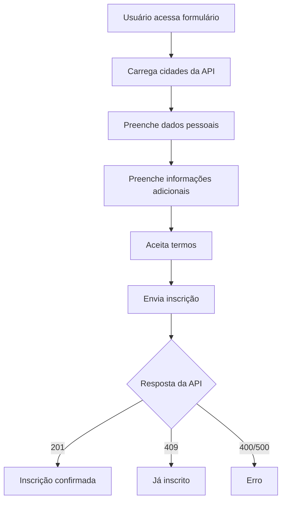

# 🏍️ Rancheiros MC - Formulário de Inscrição

Formulário público de inscrição para cursos de motociclismo da Rancheiros MC. Este projeto permite que interessados se inscrevam para participar dos cursos oferecidos pela organização.

## 📋 Sobre o Projeto

O **Rancheiros MC Form** é uma aplicação React que oferece um formulário de inscrição em múltiplas etapas para cursos de motociclismo. O sistema permite que usuários se inscrevam de forma simples e intuitiva, com validação em tempo real e integração com a API do backend.

### 🎯 Funcionalidades

- **Formulário Multi-etapas**: Interface dividida em 3 etapas para melhor experiência do usuário
- **Validação em Tempo Real**: Validação client-side com feedback imediato
- **Seleção Dinâmica de Cidades**: Cidades carregadas automaticamente da API
- **Validação Brasileira**: Validação de CPF, CNH e telefone usando padrões brasileiros
- **Responsivo**: Interface adaptável para desktop e mobile
- **Acessível**: Componentes acessíveis com Mantine UI

## 🚀 Tecnologias Utilizadas

- **React 18** - Biblioteca principal
- **TypeScript** - Tipagem estática
- **Mantine UI** - Componentes de interface
- **Zod** - Validação de schemas
- **js-brasil** - Validação de documentos brasileiros
- **Create React App** - Tooling e build

## 📦 Instalação

### Pré-requisitos

- Node.js (versão 22 ou superior)
- npm (versão 10 ou superior)
- Backend rancheiros-backend rodando

### Passos para Instalação

1. **Clone o repositório**
   ```bash
   git clone <url-do-repositorio>
   cd rancheirosmc-form
   ```

2. **Configure a versão do Node.js**
   ```bash
   # Se usando nvm
   nvm use
   
   # Ou instale a versão 22
   nvm install 22
   nvm use 22
   ```

3. **Instale as dependências**
   ```bash
   npm install
   ```

4. **Configure as variáveis de ambiente**
   ```bash
   cp env-example.txt .env
   ```
   
   Edite o arquivo `.env` e configure:
   ```env
   REACT_APP_BACKEND_ADDRESS=http://localhost:3000
   ```

5. **Inicie o servidor de desenvolvimento**
   ```bash
   npm start
   ```

6. **Acesse a aplicação**
   ```
   http://localhost:3000
   ```

## 🛠️ Scripts Disponíveis

### `npm start`
Inicia o servidor de desenvolvimento.\
Abra [http://localhost:3000](http://localhost:3000) para visualizar no navegador.

### `npm test`
Executa os testes em modo interativo.

### `npm run build`
Cria a versão de produção na pasta `build`.\
O build é otimizado e minificado para melhor performance.

### `npm run eslint`
Executa o linter para verificar e corrigir problemas de código.

## 📝 Estrutura do Formulário

### Etapa 1: Dados Pessoais
- **Nome completo** (obrigatório)
- **Telefone** (obrigatório, formato brasileiro)
- **CNH** (obrigatório, validação brasileira)
- **UF da CNH** (obrigatório)
- **Cidade do treinamento** (obrigatório, seleção dinâmica)

### Etapa 2: Informações Adicionais
- **Email** (opcional)
- **Uso da motocicleta** (obrigatório)
  - Instrumento de trabalho (motofretista)
  - Deslocamentos casa – trabalho
  - Somente lazer
- **Marca da moto** (opcional)
- **Modelo da moto** (opcional)

### Etapa 3: Termos e Condições
- **Aceite dos termos** (obrigatório)
- **Confirmação final**

## 🔧 Configuração

### Variáveis de Ambiente

| Variável | Descrição | Exemplo |
|----------|-----------|---------|
| `REACT_APP_BACKEND_ADDRESS` | URL base do backend | `http://localhost:3000` |

### Integração com Backend

O formulário se integra com os seguintes endpoints:

- **GET** `/locations/public/cities` - Busca cidades disponíveis
- **POST** `/enrollments/public` - Envia inscrição

## 📊 Fluxo de Dados



## 🎨 Interface

### Componentes Principais

- **EnrollmentForm**: Componente principal do formulário
- **Page1**: Primeira etapa (dados pessoais)
- **Page2**: Segunda etapa (informações adicionais)
- **Page3**: Terceira etapa (termos e condições)

### Temas e Estilos

- Design responsivo com Mantine UI
- Cores e tipografia consistentes
- Componentes acessíveis
- Feedback visual para diferentes estados

## 🧪 Testes

```bash
# Executar todos os testes
npm test

# Executar testes em modo watch
npm test -- --watch

# Executar testes com coverage
npm test -- --coverage
```

## 📦 Build para Produção

```bash
# Criar build de produção
npm run build

# Servir build localmente (opcional)
npx serve -s build
```

## 🚀 Deploy

### Opções de Deploy

1. **Netlify**
   - Conecte o repositório
   - Configure build command: `npm run build`
   - Configure publish directory: `build`

2. **Vercel**
   - Conecte o repositório
   - Configure framework: Create React App
   - Deploy automático

3. **Servidor Estático**
   - Execute `npm run build`
   - Faça upload da pasta `build` para seu servidor

## 🔍 Troubleshooting

### Problemas Comuns

**Erro de conexão com backend**
- Verifique se o backend está rodando
- Confirme a URL em `REACT_APP_BACKEND_ADDRESS`
- Verifique CORS no backend

**Cidades não carregam**
- Verifique conexão com internet
- Confirme endpoint `/locations/public/cities`
- Verifique logs do console

**Validação não funciona**
- Verifique se todos os campos obrigatórios estão preenchidos
- Confirme formato dos dados (telefone, CNH)
- Verifique logs de erro no console

## 📚 Documentação Adicional

- [Changelog](CHANGELOG.md) - Histórico de mudanças
- [Mantine UI](https://mantine.dev/) - Documentação dos componentes
- [Zod](https://zod.dev/) - Documentação de validação
- [React](https://reactjs.org/) - Documentação do React

## 🤝 Contribuição

1. Fork o projeto
2. Crie uma branch para sua feature (`git checkout -b feature/AmazingFeature`)
3. Commit suas mudanças (`git commit -m 'Add some AmazingFeature'`)
4. Push para a branch (`git push origin feature/AmazingFeature`)
5. Abra um Pull Request

## 📞 Suporte

Para suporte e dúvidas:
- Abra uma issue no repositório
- Entre em contato com a equipe de desenvolvimento

---

**Rancheiros MC** - Formulário de Inscrição v1.0.0